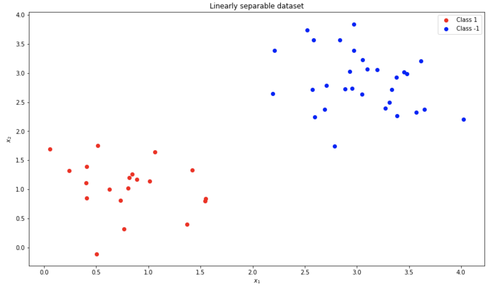
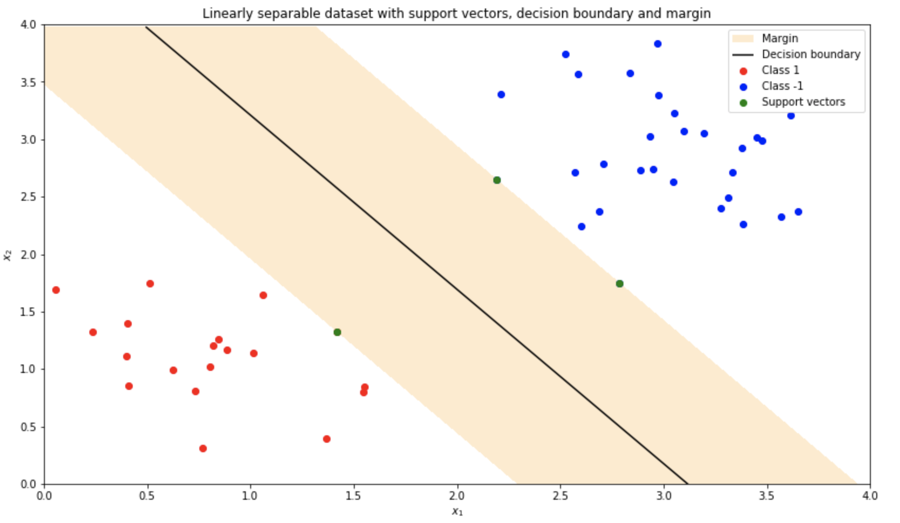
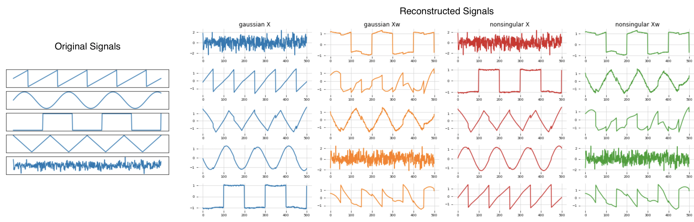
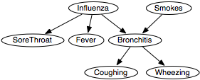

# Machine Learning

### Description
Welcome to our __Machine Learning__ reposetory! Here you will find various projects from __polynomial regression__ to fully-connected __neural networks__ from scratch, __SVM__ and __Gaussian Processes__!
On Part II, we analize __Independent Component Analysis__, __Graphical Models__, __EM__ and __VAEs__!

# Machine Learning: Part I

## [__Lab 1: Linear Regression and Overfitting__](machine_learning_1/lab1/lab1.ipynb)

### Part 1: Polynomial Regression

  

    Polynomial regressions as prediction function, along with the data and the original sine function of various polynomial order. 

### Part 2: Bayesian Linear (Polynomial) Regression

  
  

    Bayesian linear regression model
    <b>Left:</b> Plot of predictive distribution
    <b>Right:</b> 100 polynomials sampled from the parameter posterior distribution

## [__Lab 2: Classification__](machine_learning_1/lab2/lab2.ipynb)

### Part 1: Multiclass logistic regression

  
  

    MNIST:
    <b>Left:</b>  visualisation of the first 8 digits of the trainingset
    <b>Right:</b> visualization of leanred weights.

  
  

    <b>Left:</b>  Easiest digits for classification.
    <b>Right:</b> Hardest digits for classification

### Part 2: Multilayer perceptron

  
  
  

    Weights of the hidden layer at epoch 0, 4 and 9.

### Comparison

  
  

    <b>Left:</b>  Multiclass logistic regression
    <b>Right:</b> Multilayer perceptron

## [__Lab 3__: Gaussian Processes and Support Vector Machines](machine_learning_1/lab3/lab3.ipynb)

### Part 1: Gaussian Processes

  

    Gaussian Processes.

### Part 2: Support Vector Machines

  
  

    Support Vector Machines.

# Machine Learning: Part II

## [__Lab 1 - Independent Component Analysis__](machine_learning_2/lab_1/12402559_12141666_lab1.ipynb)

In this assignment, we implement the __Independent Component Analysis__ algorithm,
as described in chapter 34 of David MacKay's book "Information Theory, Inference, and Learning Algorithms".

  

    Results of signal reconstruction using different priors and W matrix initialization.

## [__Lab 2 - Inference in Graphical Models__](machine_learning_2/lab_2/12402559_12141666_lab2.ipynb)

In this assignment, we implement the sum-product and max-sum algorithms for factor graphs over discrete variables.
We implemented these algorithms to a medical graph, in order to infer the possible decease.

  

    Medical Directed Graph.

## [__Lab 3 - Expectation Maximization and Variational Autoencoder__](machine_learning_2/lab_3/12402559_12141666_lab3.ipynb)

In this assignment, we implement the Expectation Maximization (EM) algorithm and Variational Autoencoder (VAE)
on the MNIST dataset of written digits.

  

    VAE's leanred manifold of the MNIST dataset of written digits.

#### _Acknowledgement - References_

_The majority of the projects come from the lab assignments of the [Machine Learning 1](http://coursecatalogue.uva.nl/xmlpages/page/2018-2019-en/search-course/course/63074) and [Machine Learning 2](https://coursecatalogue.uva.nl/xmlpages/page/2019-2020-en/search-course/course/73105) courses of the MSc in Artificial Intelligence at the University of Amsterdam._