# Machine Learning

## Description
Welcome to our __Machine Learning__ reposetory! Here you will find various projects from __polynomial regression__ to fully-connected __neural networks__ from scratch, __SVM__ and __Gaussian Processes__!

### __Lab 1__: Linear Regression and Overfitting

#### Part 1: Polynomial Regression

  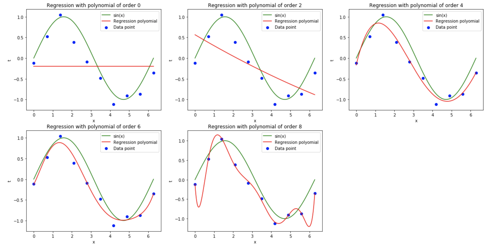

    Polynomial regressions as prediction function, along with the data and the original sine function of various polynomial order. 

  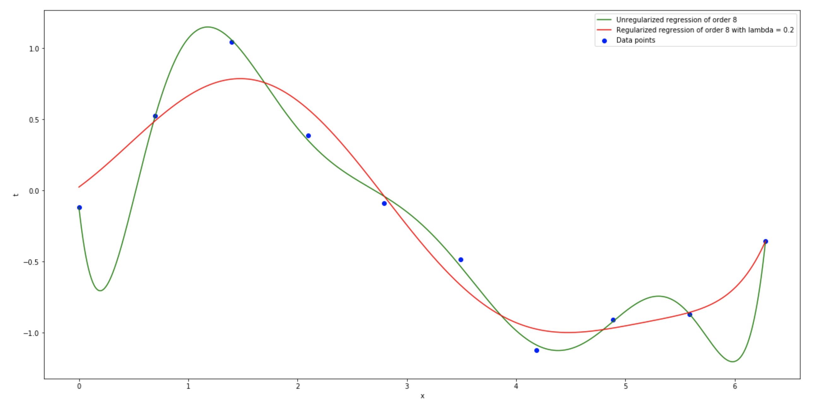
  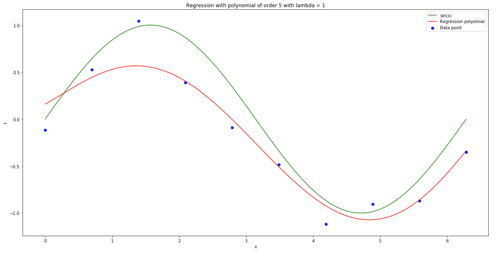

    <b>Left:</b> Polynomial regression with and without regularization. In regularized polynomial regression, the regularization term acts as a penalty term and has the desired effect of reducing the magnitude of the coefficients.
    <b>Right:</b> Best cross-validated fit (M =  5, lambda = 1.0)

#### Part 2: Bayesian Linear (Polynomial) Regression

  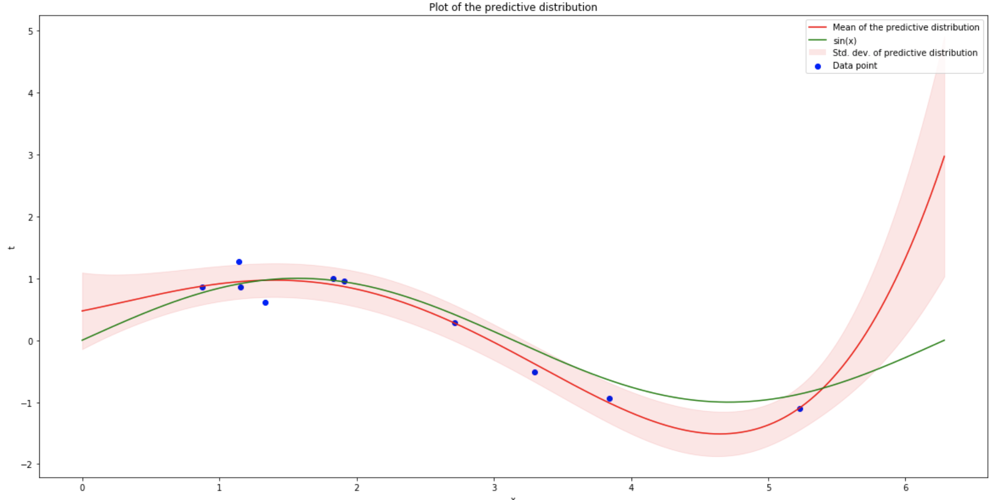
  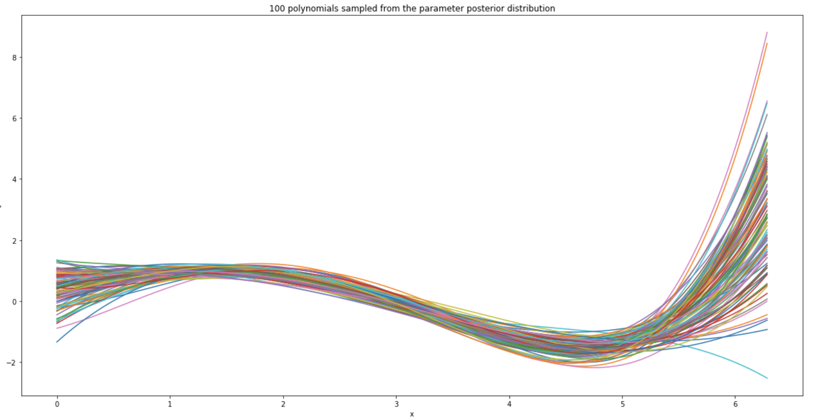

    Bayesian linear regression model
    <b>Left:</b> Plot of predictive distribution
    <b>Right:</b> 100 polynomials sampled from the parameter posterior distribution

### __Lab 2__: Classification

#### Part 1: Multiclass logistic regression

  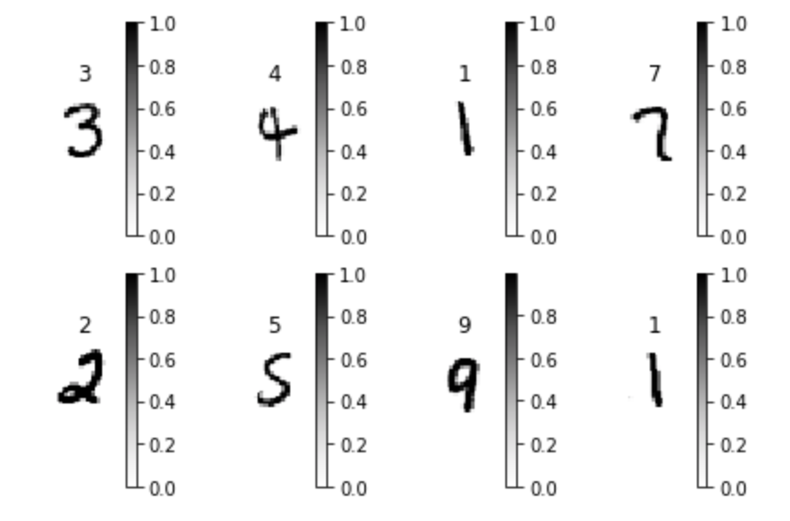
  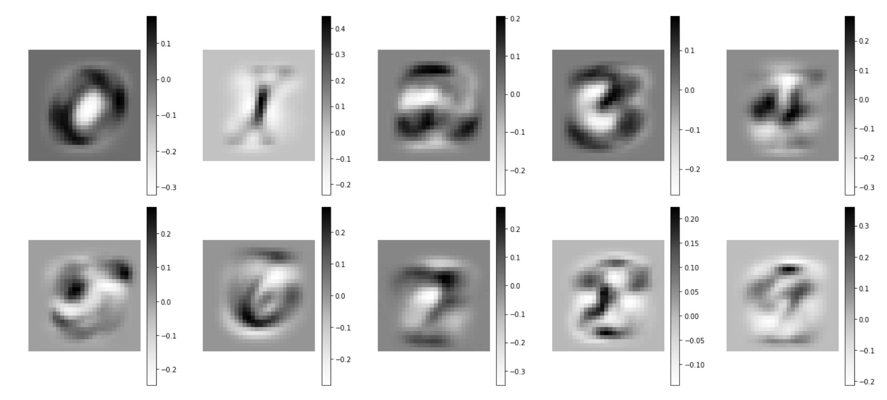

    MNIST:
    <b>Left:</b>  visualisation of the first 8 digits of the trainingset
    <b>Right:</b> visualization of leanred weights.

  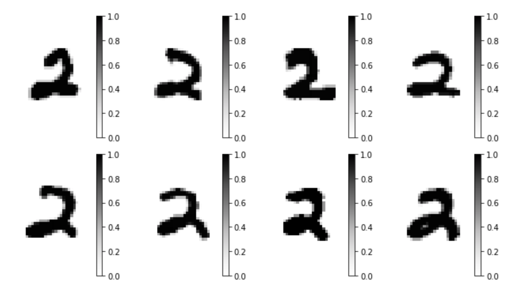
  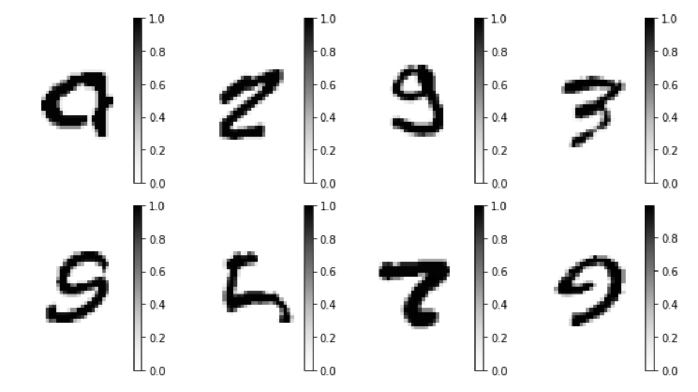

    <b>Left:</b>  Easiest digits for classification.
    <b>Right:</b> Hardest digits for classification

#### Part 2: Multilayer perceptron

  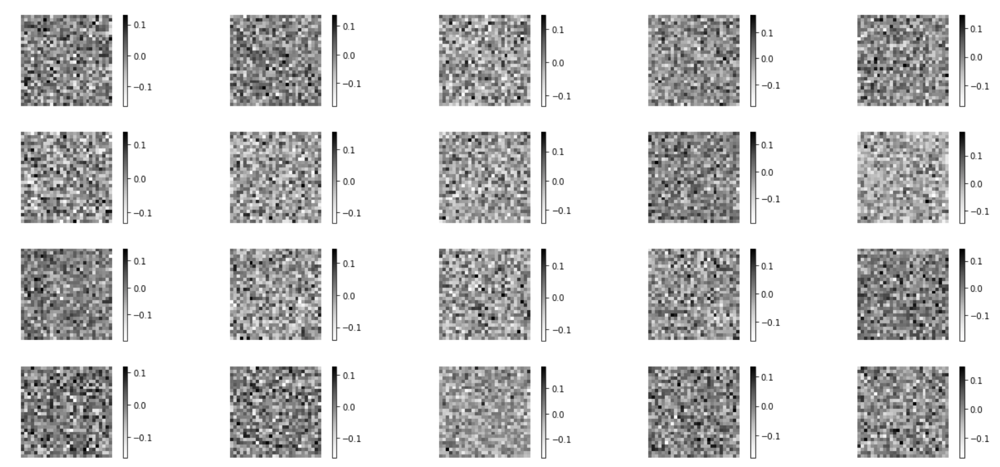
  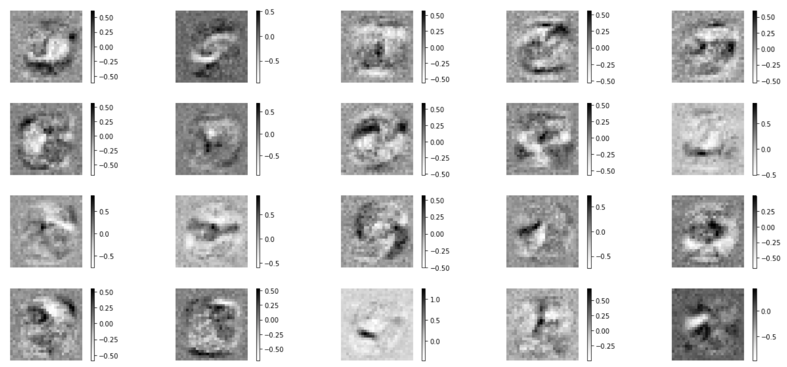
  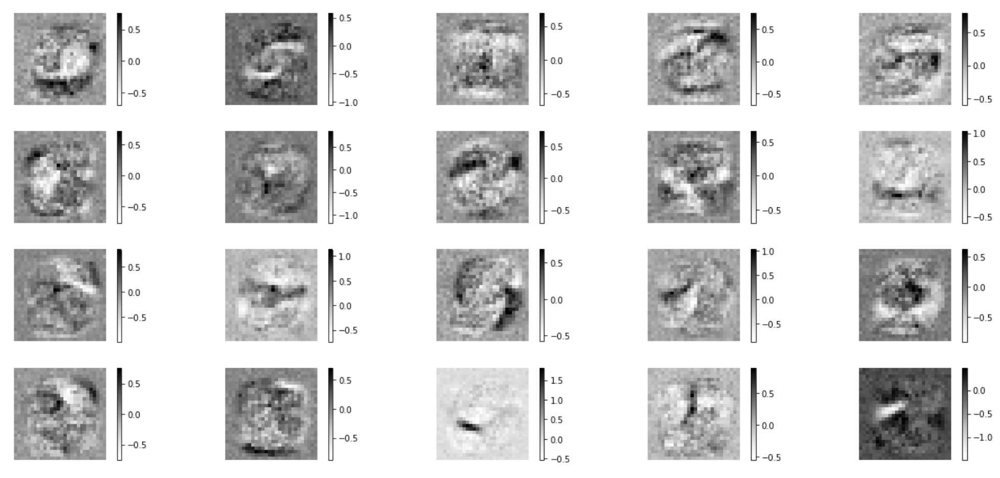

    Weights of the hidden layer at epoch 0, 4 and 9.

  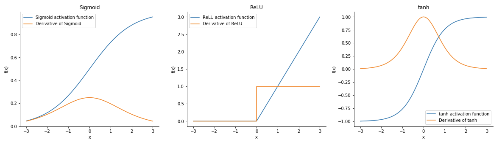

    Different activation functions.

#### Comparison

  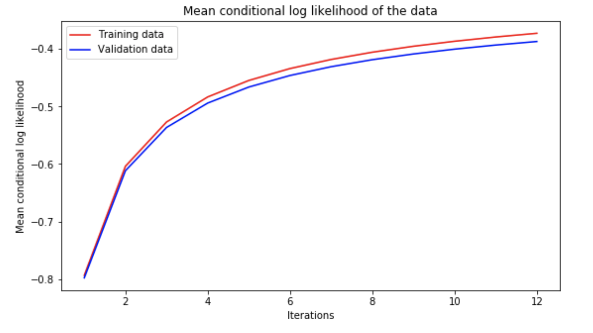
  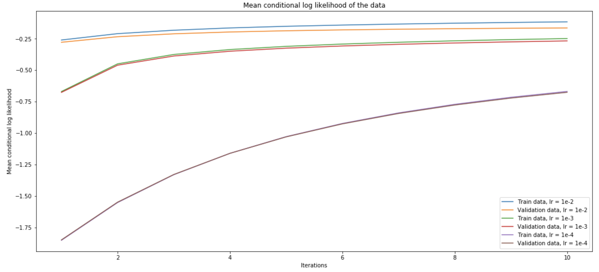

    <b>Left:</b>  Multiclass logistic regression
    <b>Right:</b> Multilayer perceptron

### __Lab 3__: Gaussian Processes and Support Vector Machines

#### Part 1: Gaussian Processes

  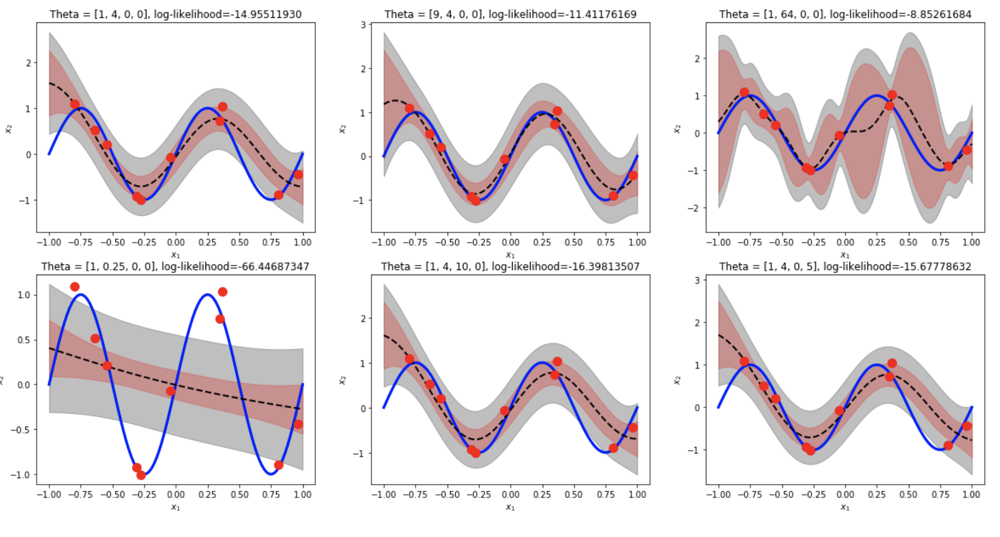

    Gaussian Processes.

#### Part 2: Support Vector Machines

  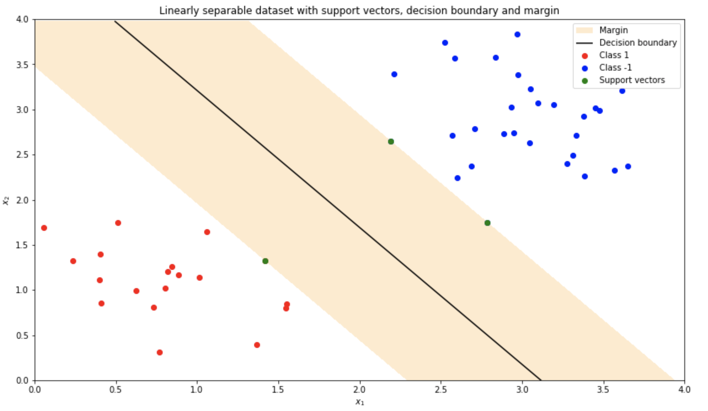

    Support Vector Machines.

###### _Acknowledgement - References_

_The majority of the projects come from the lab assignments of the [Machine Learning 1](http://coursecatalogue.uva.nl/xmlpages/page/2018-2019-en/search-course/course/63074) course of the MSc in Artificial Intelligence at the University of Amsterdam._